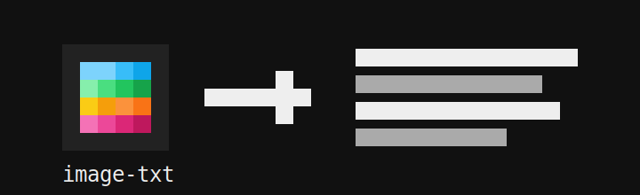

# image-txt

> Send images where only text is allowed.

<p align="center">
  
</p>

## Motivation

Ever been on a flight where messaging apps work, but sending images is blocked?

`image-txt` was built for exactly that kind of loophole: convert an image into plain text, send it as a bunch of normal text messages, then decode it back into an image on the other side.

Built during my freshman year in **Python**, this was a fun systems project exploring encoding, fragmentation, and reconstruction.

## What It Does

```text
image → text → fragments → text messages → aggregated text → image
```

`image-txt` has five simple parts:

* **Encoder** — converts an image into text
* **Fragmenter** — breaks the text into message-sized chunks
* **Transport** — send the chunks however you want
* **Aggregator** — joins the chunks back together
* **Decoder** — reconstructs the image

## Usage

1. Rename your image to `sample.jpg`
2. Run the encoder to generate `encoded.txt`
3. Run the fragmenter to split it into chunks
4. Send the chunks through any text-only channel
5. Run the aggregator to rebuild `aggregated.txt`
6. Run the decoder to generate the final image

## Output Files

```text
encoded.txt          # text version of the image
fragments/           # message-sized chunks
aggregated.txt       # rebuilt encoded file
sample_decoded.jpg   # reconstructed image
```

## Why This Is Cool

This is not trying to be the most efficient image transfer system.

It is a tiny hacky experiment in asking:

> What if an image could pretend to be text?

## Future Ideas

* Fragment headers
* Checksums
* Automatic ordering
* Compression
* Cleaner CLI
* Better image format support
Cover image: Skitterphoto / Pixabay, via Wikimedia Commons, CC0.
